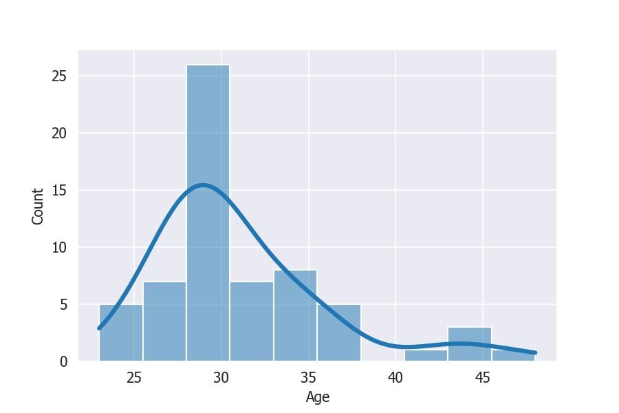
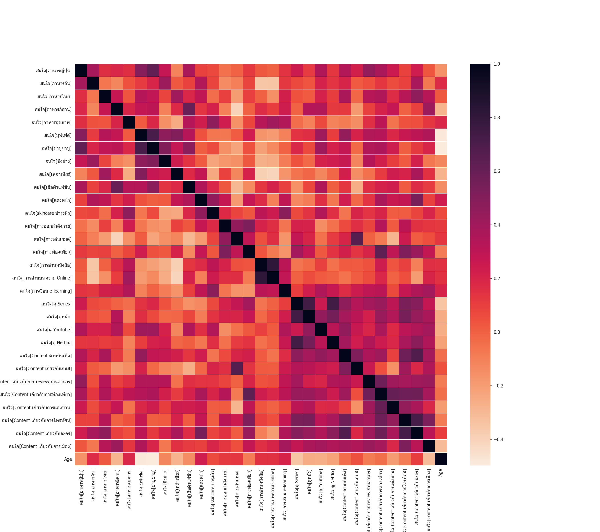
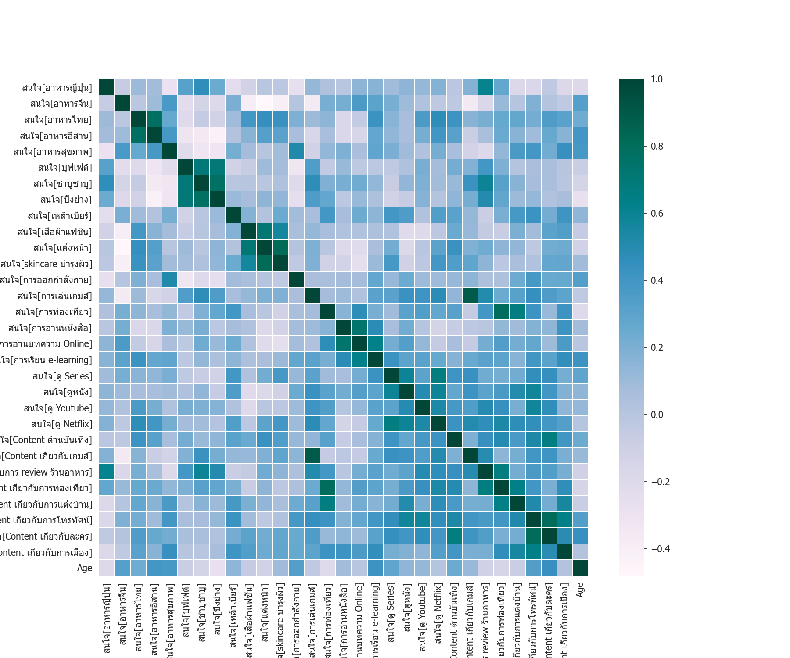
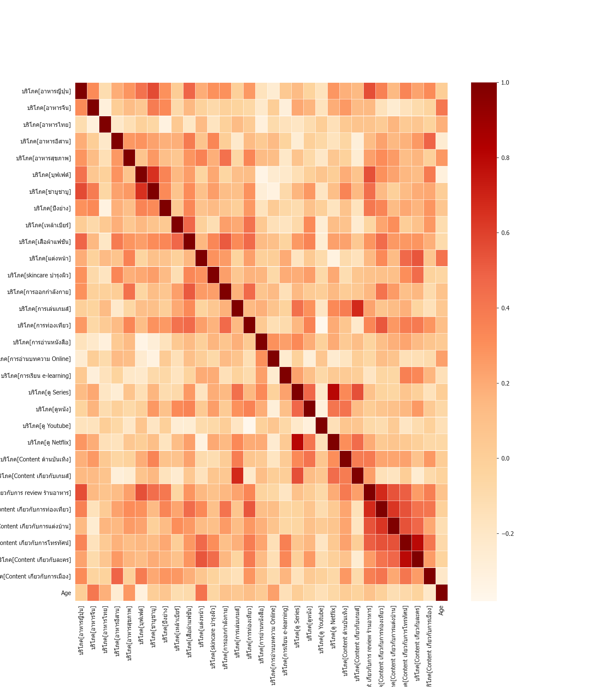
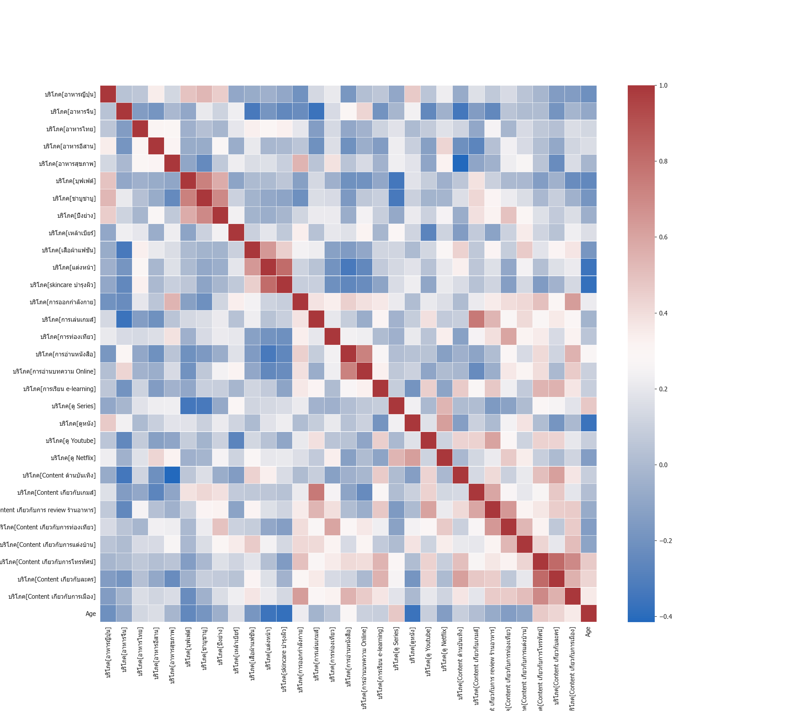
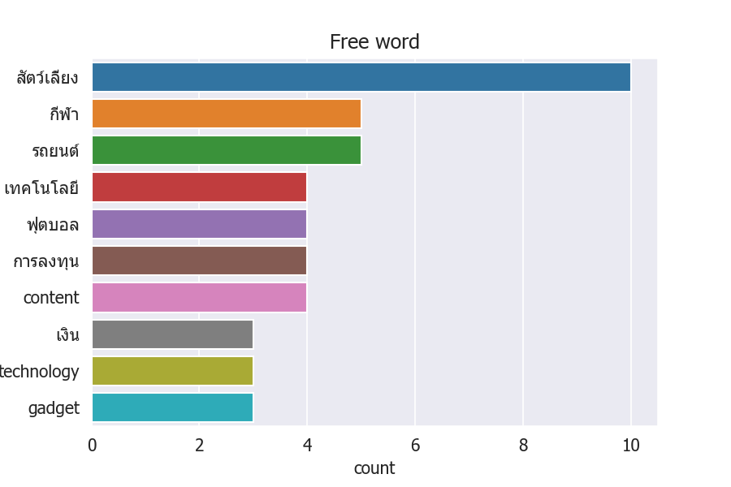
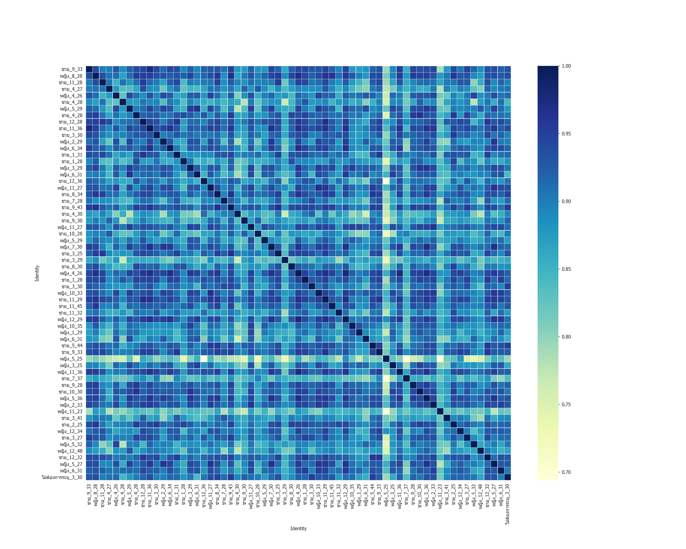

#   HomeWork 1 Customer Survey 
#### Dataset : Customer questionare survey with  students on CRM Class
Name : Rangsarid Pringwanid Id 62010422038

Objective on Hw1 :   
    conduct customer servey on relationships of customer interested and customer consumption and free text comment filled 
#### Notebook : [Customer_Behaviors_Survey](https://github.com/rangsarid/BADS7105/blob/main/Homework%2001/HW1_Customer_Behaviors_Survey.ipynb).   
#### Google_Colab : [Colab](https://colab.research.google.com/drive/1qFgz0oKhKABhaTuaVqZj_dDW8CO_i07S#scrollTo=_jDmVwtX35_k).

### Data Exploratoty 
##### Data Demography 
Show age distributed

Show age distributed by gender

#### Correlation plot of Interested by Gender

show correlation plot of interests by Male  

show correlation plot of interests by Female  

#### Correlation plot of comsumption by Gender
show correlation plot of consumption by Male

show correlation plot of interests by Female  

## Free Text Comment analysis 
##### Refer Freetext comments from customer survey. I use nlp processing to clean up and classifies the free texts by customer's fovor activity type and show the top 10 frequency as below graph

## User similarity 
##### use cosine similarity finding the similar user . And also indentify user by Gender_Month-of-Birth_Age  examplt ('ชาย_9_33')  
 
 Show similarity score by heatmap graph as below

