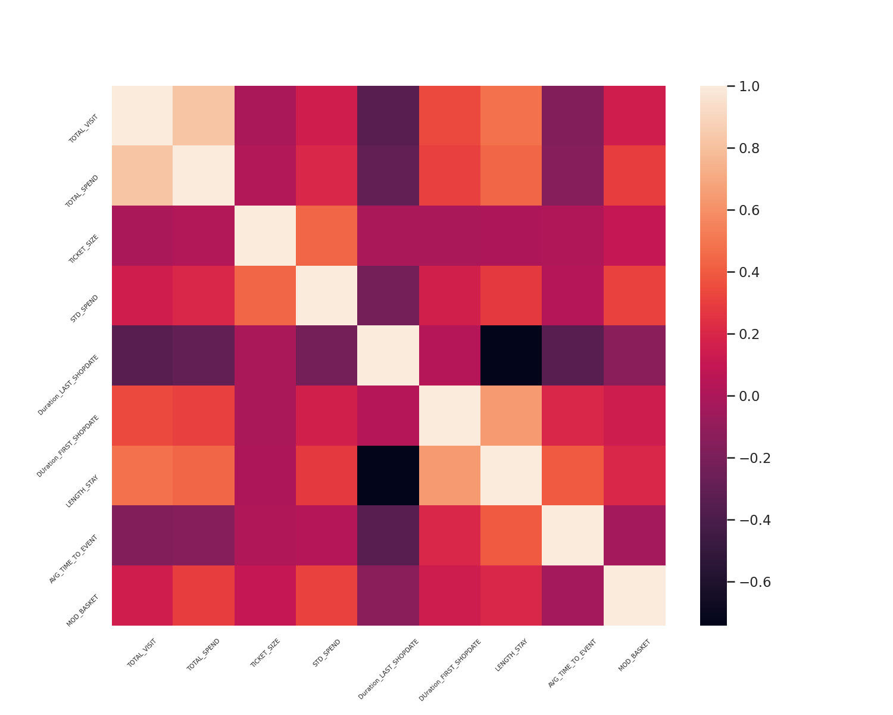
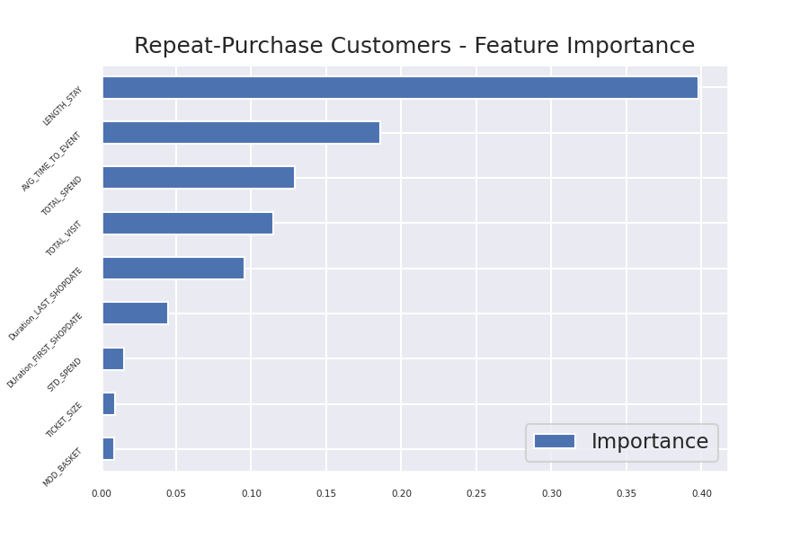

## Homework6 | Customer Segmentation
### Objective : Purpose to segment and cluster customers to the group identifies characteristics of customer . Created future engagment
#### Name : Rangsarid Pringwanid ID: 6210422038
#### Dataset : Public retail  supper markey dataset csv file

### Methodogy
1. Created and prepair data on google Bigquery
2. Aggregated data and created  data feature  (Data prepairing process) to crated K-mean clustering model with  python codding  via google colab
3. Analysis with model result , feature improtance  
### Feature Engineering
    Created features  as below :
1. TOTAL_VISIT => Total visit of each customer 
2. TOTAL_SPEND => Total spend of each customer
3. TICKET_SIZE => Average Spend of each customer
4. STD_SPEND  => Standardiviation spend of each customer
5. Duration_LAST_SHOPDATE => Duration(day) between the last time shopdate and now of each customer
6. Duration_FIRST_SHOPDATE  => Duration(day) between since first shopdate  and now of each customer
7. LENGTH_STAY => Duration to be customer since first shopdate untill  last shopdate
8. AVG_TIME_TO_EVENT =>  Average of LENGTH_STAY by  total visit
9. MOD_BASKET => Favorite basket site for each customer
    Here this SQL Query data prepared to model : [SQL CLustering Model](sql_cluster.sql).              
#### below graph  show the correlation of features 
.

### Clustering Model 
To selected K is number of clustering , would like to get the best K pactics  by applies Elbow method and Silhouette . Here below are  Elbow method and Silhouette graph 
#### Elbow method graph 

.
.

 At K = 3 is strongly decreasing loss value at elbow graph and highly score at Silhouette graph 

 ### Clustering Analysis 
This step do analysis which features have more importance with clsuter and how performed clsuter. 
 as below are feature importance graph .   
.

found the feature  "Total_spend" , "STD_SPEND" and "TICKET_SIZE" are the top3 importance feature scores more than others 

### Final Model Result
.

### Interpretation Result

