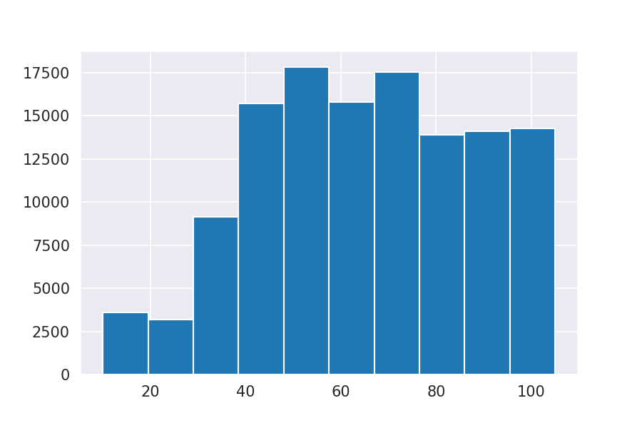
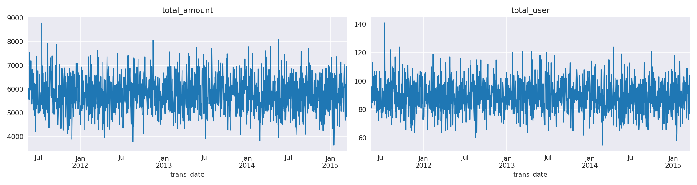

## Homework 8 | Campaign Response
**Objective :** Improvement Model accuracy rate and model performance by machine learning techniques  
**Name :** Rangsarid Pringwanid   
**ID :** 62010422038  
**Dataset :**  Campaign Response.csv and Transaction.csv file 

### Data Exploratory 
**Show distirbuted total amount by  frequency transaction**  
 

**Show series total amount and total customer by  datetime**  
 

### Feature Enginerring 
  Created relevant feature as below 
  
  

