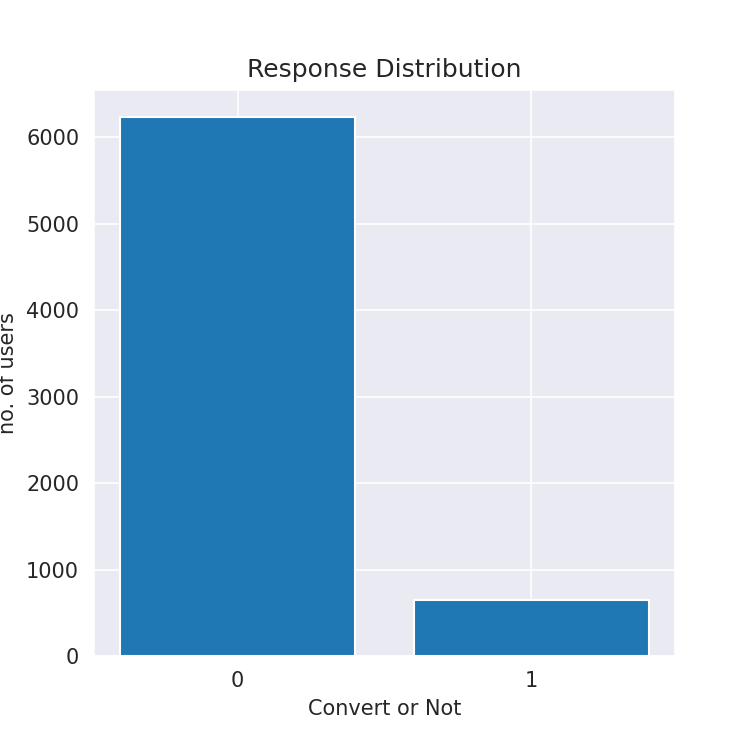
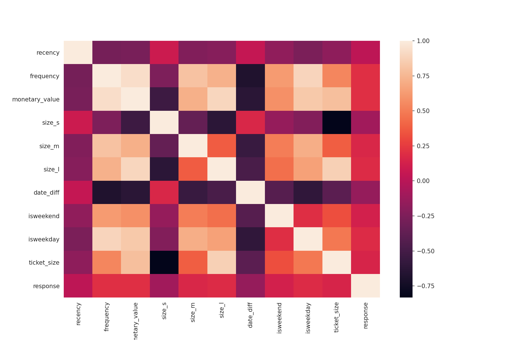

## Homework 8 | Campaign Response
**Objective :** Improvement Model accuracy rate and baseline model performance by machine learning techniques  
**Name :** Rangsarid Pringwanid   
**ID :** 62010422038  
**Dataset :**  Campaign Response.csv and Transaction.csv file 

### Data Exploratory 
**Show distirbuted total amount by  frequency transaction**  
 

**Show series total amount and total customer by  datetime**  
 

**Show Imbalance campaign response data with label**  
 

## Model Imprementation 
#### Feature Enginerring 
  Created relevant feature as below  
  1. AOU  
  2. NO.transaction on Weekend/Weekday  
  3. No.transaction on  Size of Amount (S,M,L)  
  4. No.date between previous purchased
  5. monetary_value
  6. Frequency

**show Correlation between features** 
 

### Data Re-sampling 
  1. Under Sampling
  2. Over Sampling
  3. SMOTE
  4. SMOTE-Tomek Links

### Models
  1. Logistic Regression
  2. XG-Boost
## Model Tuning 
   Cross validation with StratifiedKFold 10 Folds
   
| Command | Description |
| --- | --- |
| git status | List all new or modified files |
| git diff | Show file differences that haven't been staged |   

## Result    
- Logistic Regression   

|  model  |	resampler   |	train-mean |	train-min |	train-max | test-mean |	test-min |	test-max |
| --- | --- | --- | --- | --- | --- | --- | --- | 
| logistic | undersampler |	 0.62    | 0.60       |  0.63      |  0.61    |	 0.58    |   0.65    |
| logistic	| oversampler	|      0 	   | 	    0      |    0      |     0    |	  0      |    0     |
| logistic	| smote	      |      0.62  | 	 0.60    |    0.63   |   0.61    |		  0.59      |     0.65    |
| logistic	| smote-tomek	 |      0.62 	   | 	  0.61    |	  0.63    |    0.62  |	  0.59 |   0.64  |
  
- XG-Boost   
  
|  model  |	resampler   |	train-mean |	train-min |	train-max | test-mean |	test-min |	test-max |
| --- | --- | --- | --- | --- | --- | --- | --- | 
| XG-Boost | undersampler |	 0.62    | 0.60       |  0.65      |  0.60    |	 0.56   |   0.64    |
| XG-Boost	| oversampler	|      0 	   | 	    0      |    0      |     0    |	  0      |    0     |
| XG-Boost	| smote	      |      0.90  | 	 0.89    |    0.90   |   0.89    |		  0.88      |     0.90    |
| XG-Boost	| smote-tomek	 |      0.90	   | 	  0.89    |	  0.90    |    0.89  |	  0.87 |   0.91  |
  

