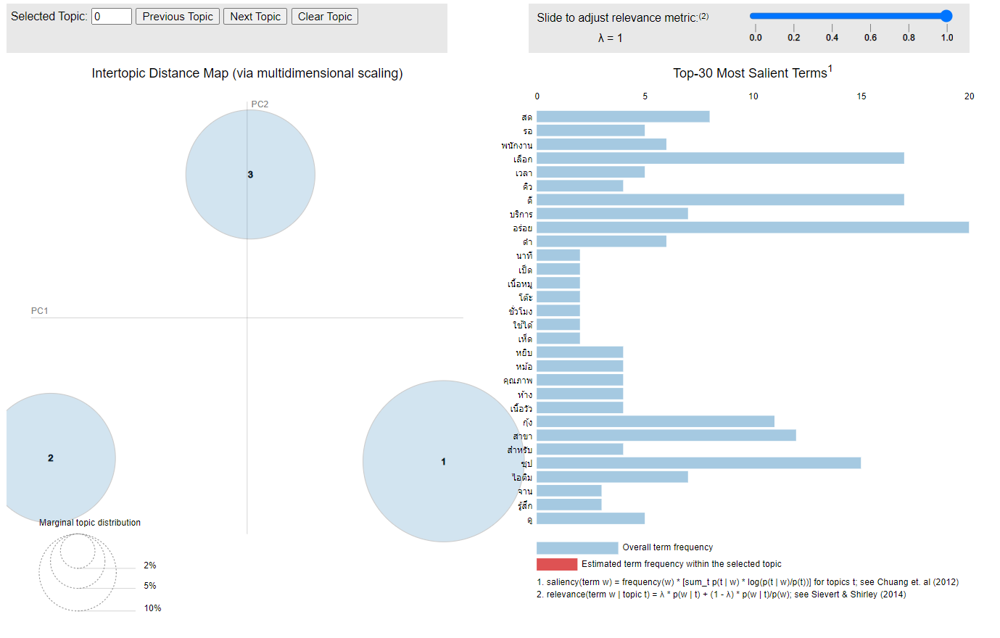
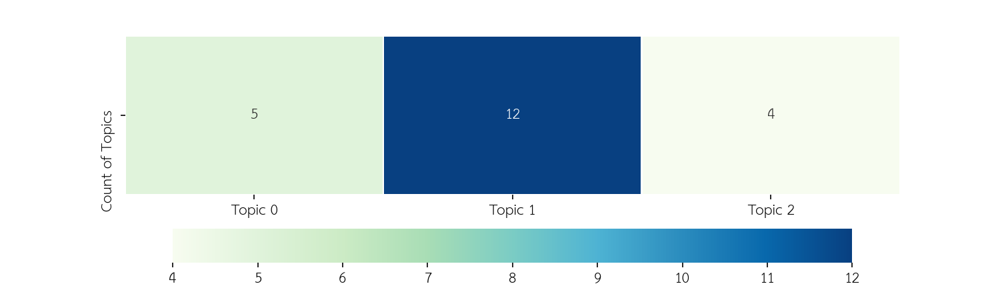

## Homework 11 | Customer Review 
#### Objective : Find topic modeling of word to initial titles name 
##### Name : Rangsarid Pringwanid ID :  6210422038
**Dataset:** Collect csv file from wongnai comment with Sabu resturant at the mall bangkapi  
### Data Exploratory 
**Show distribution Sentense word length**  

### Imprement Processing
-1. Clean special word, puntuation , numerical and space  
-2. Use Pythai NLP to sentense of comment 
-3. Use Pythai Nlp to word tokenization 
-4. Remove common words by Pythai's stopword corpus  and any specify  common word on SABU resturant review  domain 

**Show word cloud and top 25 frequency words**  
 

 ## Topic Modeling by LDA
Defined number of topics with 3 topic, visualization by LDA whether the distance between inter-topic on a topic cluster  
**LDA 3 Topics visualization** 

**Display by HTML page :** [LDA Visualization](Hw11/lda.html)  

## Result 
The most scores topic words :   
    
    Topic 0 :  'ทดแทน', 'ราคา', , 'ไอศกรีม', 'ตอน', 'ลงเอย', 'เดอะ', 'ปรกติ', 'หน้า', 'มมาก', 'เบอร์', 'ดู', 'ชม', 'จ่าย', 'เด็ก', 'ซูชิ', 'วันก่อน', 'นั่ง', 'บุฟเฟ่ต์', 'ตัก', 'ผัก','พิซซ่า', 'สไลด์' , 'ตัดสินใจ', 'น้ำ', 'VAT', 'ขนม', 'เนื้อ', 'ลูกชิ้น', 'โอเค', 'เดิน', 'อาหารสด', 'แกงค์', 'อาหาร', 'ร้อน', 'นิ', 'นัด', 'เหมือนกับ', 'เนื้อวัว', 'สาขา' 
    
    Topic 1 :'ละลานตา', 'ค่ายมวย', 'ฮ่า', 'เข้ากัน', 'ไอศกรีม', 'งวด', 'ทอน', 'กะปิ', 'ลุย', 'ลด', 'สรุป', 'ออสเตรเลีย', 'คอ', 'หลายชนิด', 'ถูกหวย', 'ชิ้น', 'แล้วก็', 'ไอศครีม', 'ไอติม', 'ผัก', 'กรอ', 'ชอบ', 'เป็นผู้ใหญ่', 'พิซซ่า', 'บู', 'เด้ง', 'เช็คบิล'  
    
    Topic 2 : 'โชคดี', 'เบา', 'เลิก', 'โปรโมชั่น', 'จอง', 'สมราคา', 'ร้อย', 'บริเวณ', 'ราคา', 'โดยรวม', 'ปรุง', 'เนื้อหมู', 'นิว', 'ว', 'แมค', 'พอได้', 'ไอศกรีม', 'ชั่วโมง', 'ออกร้าน', 'คุ้ม', 'หลายครั้ง', 'ข้น', 'โต๊ะ', 'สวย', 'หยิบ', 'ทอด', 'บรา', 'เดอะ', 'สุก', 'เรย', 'ข้างนอก', 'เกินไป', 'ดำ', 'กะปิ', 'ลด', 'สรุป', 'มันดี', 'คอ', 'คุ้มค่า', 'หน้า', 'โหด', 'กินที่', 'เคลื่อนตัว', 'ดู', 'บัตรสมาชิก', 'ประตู'  
show heatmap graph that the number of customer's reviews have been assigned on each topic 
 

### Conclusion 
Voice customer review help to understood more customer needed , customer satisfaction , what the customer's mentions with our brand so we use topic modeling make analysis to classify review of customer into the each topic .Additional we can user this information make customer Engagement 
to make more customer's satisfaction or convince to buy our product too.

