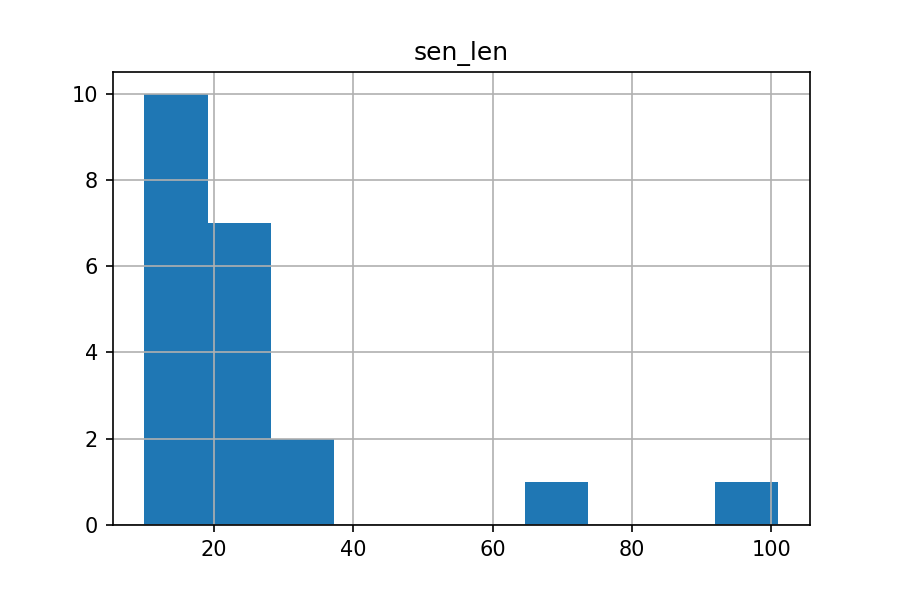
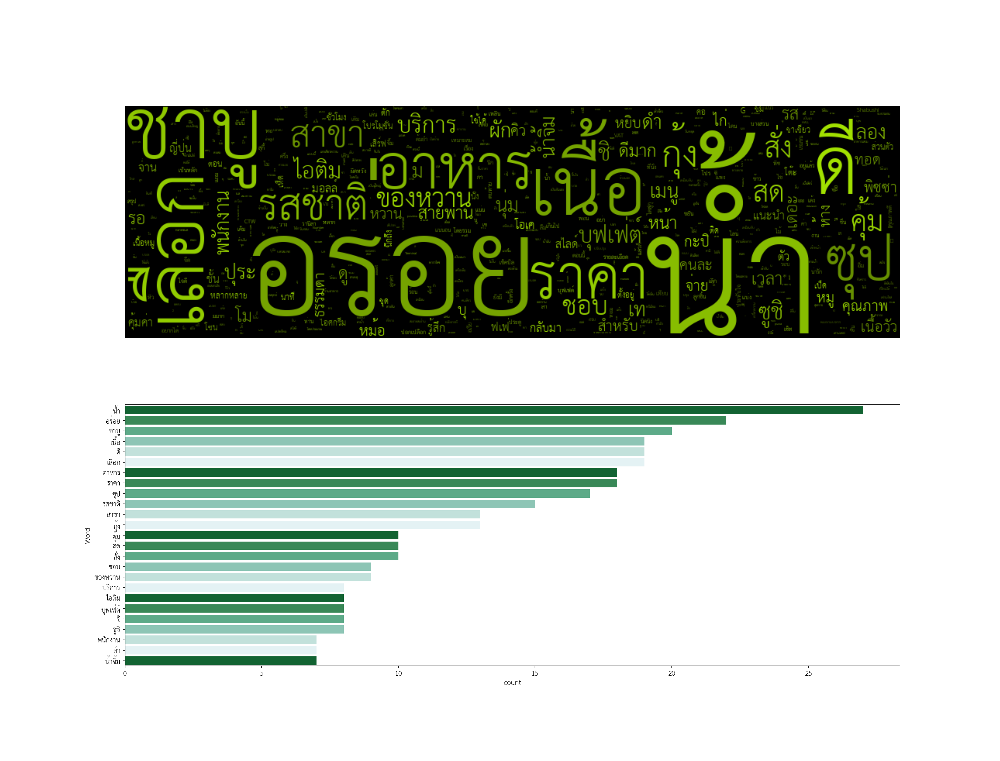

## Homework 11 | Customer Review 
#### Objective : Find topic modeling of word to initial titles name 
##### Name : Rangsarid Pringwanid ID :  6210422038
**Dataset:** Collect csv file from wongnai comment with Sabu resturant at the mall bangkapi  
### Data Exploratory 
**Show distribution Sentense word length**  

### Imprement Processing
-1. Clean special word, puntuation , numerical and space  
-2. Use Pythai NLP to sentense of comment 
-3. Use Pythai Nlp to word tokenization 
-4. Remove common words by Pythai's stopword corpus  and any specify  common word on SABU resturant review  domain 

**Show word cloud and top 25 frequency words**  
 

 ## Topic Modeling by LDA
    defined number of topics with 3 topic, visualization by LDA whether the distance between  
inter-topic on a topic cluster 
**Display by HTML page :** [LDA Visualization](Hw11/lda.html)  

